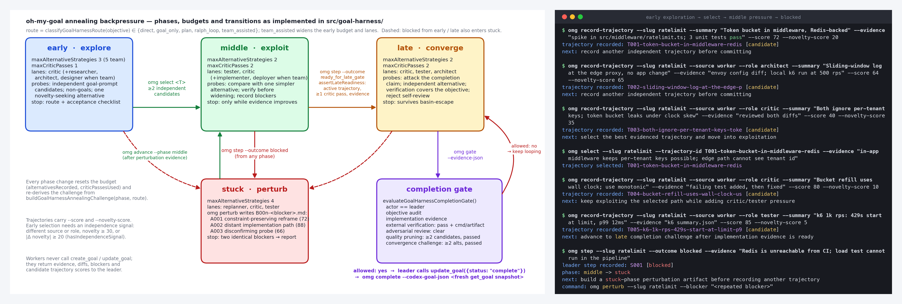
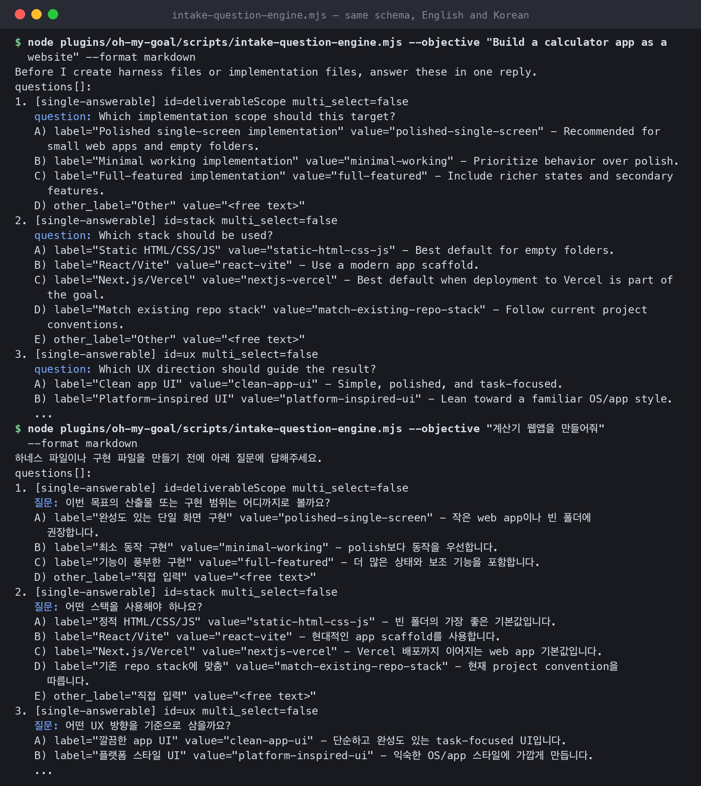
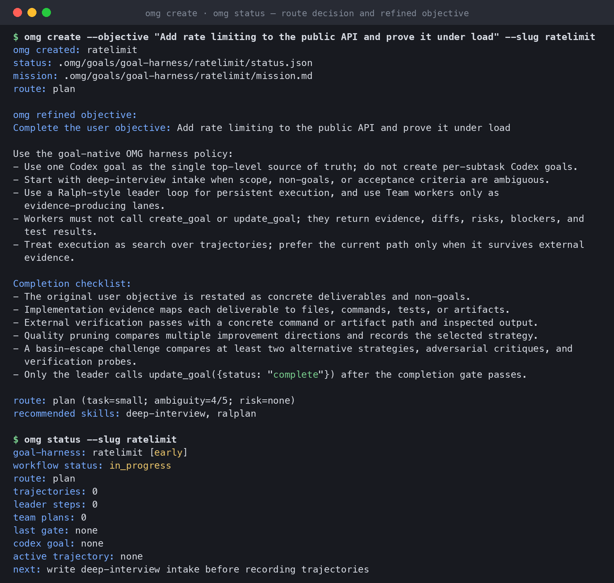
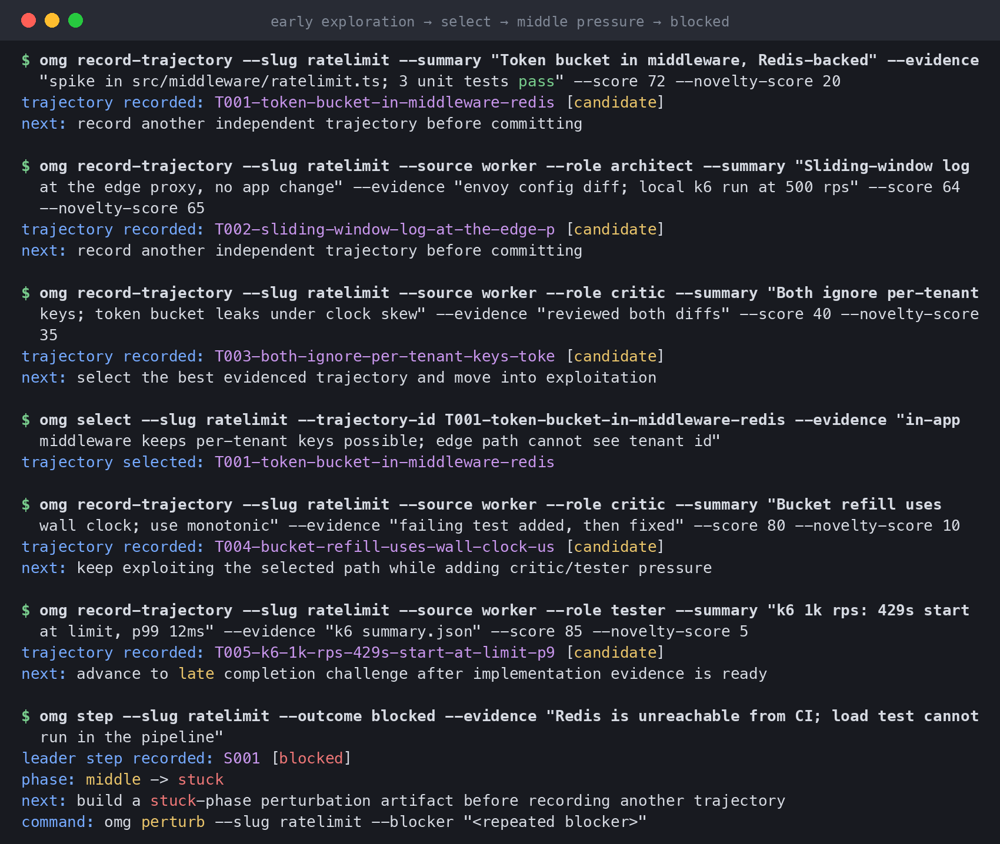
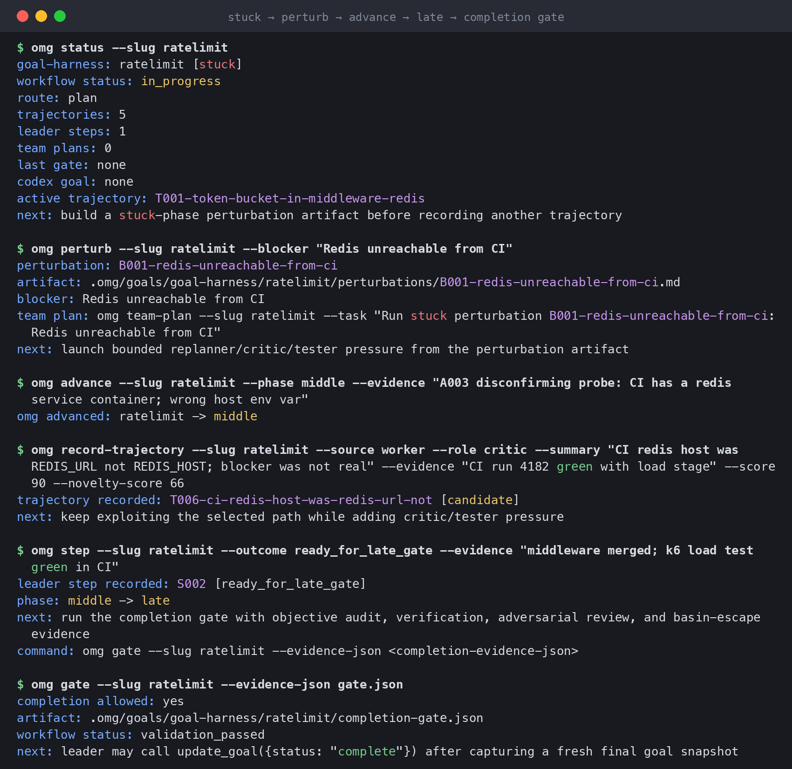
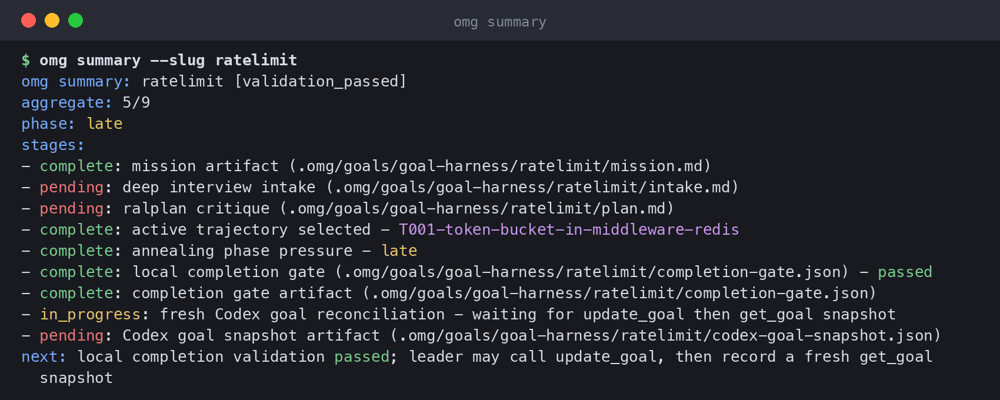
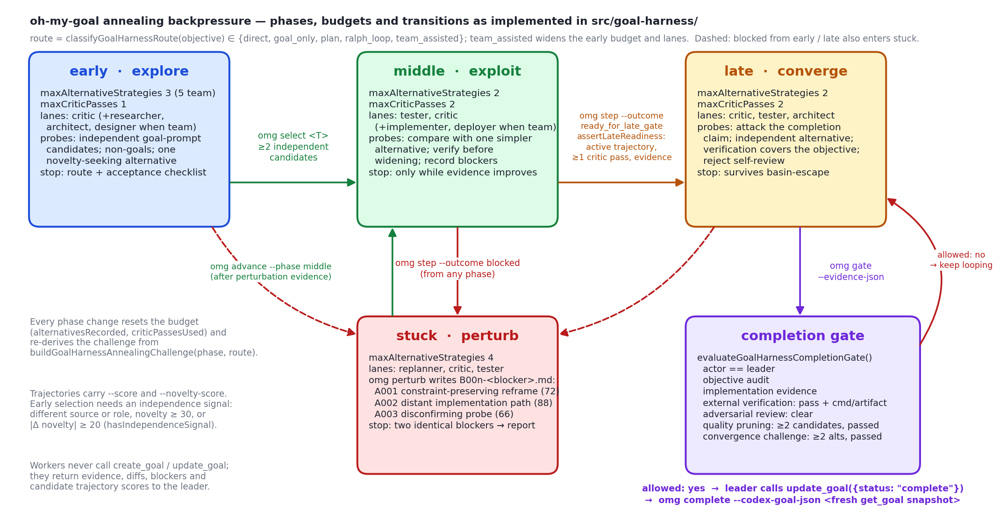

<h1 align="center">Oh My Goal</h1>

<p align="center">
  <a href="https://github.com/yc9954/oh-my-goal"></a>
  <a href="https://github.com/yc9954/oh-my-goal/actions/workflows/ci.yml"></a>
  
  
  
  
</p>

<p align="center">
  <strong>One Codex goal. A repo-local harness. Pressure against the first plausible answer.</strong><br/>
  Oh My Goal is a Codex-native plugin skill for long-running work. <code>$oh-my-goal &lt;objective&gt;</code> runs a structured intake,<br/>
  writes Markdown harness artifacts under <code>.omg/harness/&lt;slug&gt;/</code>, recommends a <code>create_goal</code> prompt, and gives the leader<br/>
  optional worker lanes, design and deployment gates, and a completion gate it cannot skip.
</p>

<h3 align="center"><a href="#getting-started"><ins>Getting started</ins></a> · <a href="#how-it-works">How it works</a> · <a href="plugins/oh-my-goal/skills/oh-my-goal/FLOW.md">The flow</a></h3>

<p align="center">
  
</p>
<p align="center"><sub>Left: the annealing state machine, drawn with matplotlib from the phase budgets and transitions in <code>src/goal-harness/policy.ts</code> and <code>runtime.ts</code>. Right: real output of <code>omg</code> (built from this repo) driving one loop in a throwaway project, rendered to PNG from the captured text. All images in this README were produced that way; none are mock-ups.</sub></p>

The name is literal. Agents that run for hours tend to lock onto the first plan that compiles and then defend it. Oh My Goal treats execution as a search over trajectories: every candidate path is recorded with evidence and a novelty score, the leader has to pick one against an independent alternative, critic and tester lanes push on the pick, a blocker throws the run into a perturbation phase instead of a retry loop, and completion is only allowed once a gate with six evidence checks says so. The "annealing" is the phase schedule: wide exploration first, bounded exploitation next, then a converge phase whose job is to attack the completion claim.

## Features

<table>
<tr>
<td width="50%" valign="middle">

### Intake before anything else

The first response is a questionnaire, not an execution turn. `intake-question-engine.mjs` reduces ambiguity first, then expands and prunes quality-improvement candidates so the goal does not converge on the first plausible path.

The plugin does not create harness files, write implementation files, or call `create_goal` until the questions are answered or the user explicitly says to use defaults ("proceed" is not enough).

Korean objectives get Korean question and option text while canonical IDs and `selected_values` stay in English, so the same answer schema works in both languages.

</td>
<td width="50%">
  
  <p align="center"><sub><code>intake-question-engine.mjs --format markdown</code> for an English and a Korean objective; three of the eleven questions shown.</sub></p>
</td>
</tr>
<tr>
<td width="50%" valign="middle">

### A route decision you can read

`omg create` classifies the objective before anything runs: task size, an ambiguity score out of five, risk signals such as `security-sensitive` or `data-migration`, and whether the text asked for a team or for persistence. That picks one of five routes, `direct`, `goal_only`, `plan`, `ralph_loop` or `team_assisted`, and the route decides how wide the early phase is allowed to be.

The refined objective carries the harness policy and the completion checklist verbatim, so the Codex goal itself says what "done" means.

</td>
<td width="50%">
  
  <p align="center"><sub><code>omg create</code> and <code>omg status</code> on a fresh harness: route <code>plan</code>, phase <code>early</code>, next action pointing at intake.</sub></p>
</td>
</tr>
<tr>
<td width="50%" valign="middle">

### Trajectories, not retries

Every candidate path is an `omg record-trajectory` call with a summary, evidence, a score and a novelty score, tagged by source (leader or worker) and role. Early selection refuses to proceed with fewer than two candidates, and the alternative has to be genuinely independent: a different source or role, novelty of 30 or more, or a novelty gap of at least 20.

Selecting moves the run into the middle phase, where the budget is two critic passes before the late gate is reachable. A `blocked` step drops the run into `stuck` from any phase.

</td>
<td width="50%">
  
  <p align="center"><sub>The exploration to exploitation hand-off, then a real blocker knocking the run into <code>stuck</code>.</sub></p>
</td>
</tr>
<tr>
<td width="50%" valign="middle">

### Stuck means perturb, and completion is gated

`omg perturb` writes a `B00n-<blocker>.md` artifact with three alternate strategies drawn from `perturbation.ts`: a constraint-preserving reframe, a distant implementation path, and a disconfirming probe that attacks the assumption that the blocker is real. The next action is a bounded replanner/critic/tester team plan, not another attempt.

`omg gate` evaluates six things: the actor is the leader, an objective audit, implementation evidence, external verification with a concrete command or artifact, an adversarial review that is clear, quality pruning with at least two candidates, and a convergence challenge with at least two alternatives. Miss one and completion is refused with the list of what is missing.

</td>
<td width="50%">
  
  <p align="center"><sub>Perturb, advance back to <code>middle</code> with evidence, take one more critic pass, enter <code>late</code>, pass the gate.</sub></p>
</td>
</tr>
<tr>
<td width="50%" valign="middle">

### One status line the leader cannot fake

`omg summary` shows the nine stages of a harness and their state. The completion gate is a local artifact; the last two stages need a fresh `get_goal` snapshot from Codex after `update_goal`, which `omg complete` reconciles against the harness. Workers never call `create_goal` or `update_goal`; they return evidence, diffs, blockers and candidate trajectory scores, and the leader decides.

</td>
<td width="50%">
  
  <p align="center"><sub><code>omg summary</code> after the gate passed: 5 of 9 stages complete, waiting on the Codex goal snapshot.</sub></p>
</td>
</tr>
</table>

**Also included**

- **Interactive intake where a surface exists.** Inside cmux it opens an in-workspace selector pane; inside attached tmux a separate question pane; on macOS a Terminal selector window. Without any of those it asks one sequential question at a time until residual ambiguity is low and quality pruning is complete.
- **A harness you can read.** Generation writes `objective.txt`, `ambiguity-map.md`, `deep-interview.md`, `execution-spec.md`, `quality-frontier.md`, `pruning-matrix.md`, `selected-strategy.md`, `design-system.md`, `deployment.md`, `secrets-and-auth.md`, `goal-prompt.md`, `agents.md`, `orchestration.md`, `team-system.md`, `trajectory-ledger.md`, `state-ledger.md`, `local-optimum-pressure.md`, `completion-gate.md`, `runtime-commands.md` and a `plugin-root-resolver.mjs` that never embeds a machine-specific cache path.
- **Visible worker lanes.** `team-runtime.mjs` writes worker packets under `.omg/runtime/team/<team>/` and opens cmux or tmux panes for leader, architect, designer, implementer, tester, deployer, critic and replanner roles. `tick` and `watch` rebalance work, create follow-ups for revise/reject/block results, reclaim stale lanes and scale bounded dynamic lanes.
- **Runtime-enforced pressure.** `pressure-runtime.mjs` forces evidence-backed baseline/novelty/critic trajectories, imports Team `result.md` files, creates perturbations for repeated blockers, and blocks completion until `gate` passes.
- **Design and deployment gates for web work.** `design-system-runtime.mjs` ports the useful UI/UX Pro Max snippets (BM25-style domain search, product classification, style/color/typography matching, token architecture, `MASTER.md` persistence) into a project-specific `design-system.md`. `deployment-runtime.mjs` writes `deployment.md`, `.env.example` placeholders and `secrets-and-auth.md` for Vercel, OpenAI-compatible keys and auth providers; `deploy` is a dry run unless the leader passes `--execute` after tests, build, auth and secret readiness are proven.
- **Secrets never touch chat.** `openai-key-runtime.mjs` preflights `OPENAI_API_KEY` and `ZEP_API_KEY`; with `--execute` in an attached terminal it takes hidden input, writes only to `.env.local`, keeps `.env*.local` in `.gitignore`, and records redacted status. Missing keys do not block intake.

---

## How it works

<p align="center">
  
</p>
<p align="center"><sub>Phases, per-phase budgets, worker lanes, required probes and stop rules are copied from <code>buildGoalHarnessAnnealingChallenge()</code> in <code>src/goal-harness/policy.ts</code>; the transitions from <code>select</code>, <code>step</code>, <code>advance</code> and <code>perturb</code> in <code>runtime.ts</code> and <code>perturbation.ts</code>; the gate checks from <code>evaluateGoalHarnessCompletionGate()</code>.</sub></p>

The plugin flow, from the `$oh-my-goal` invocation to the gate:

```text
$oh-my-goal <objective>
        │
        ▼
openai-key-runtime.mjs offer ─── optional key preflight (hidden input, .env.local only)
        │
        ▼
intake-question-engine.mjs ──▶ intake-question-runtime.mjs (cmux pane · tmux pane · macOS Terminal · sequential)
   stage 1: reduce ambiguity          stage 2: expand + prune quality candidates
        │
        ▼  answers approved by the user
create-harness.mjs --interview-complete --answers-json …
        │
        ▼
.omg/harness/<slug>/  ── goal-prompt.md ──▶ create_goal (leader session owns the goal)
        │                     │
        │                     ├─ team-runtime.mjs launch / tick / watch ──▶ .omg/runtime/team/<team>/ + cmux/tmux panes
        │                     ├─ pressure-runtime.mjs init / record / perturb / import-team / gate
        │                     ├─ design-system-runtime.mjs ──▶ design-system.md
        │                     └─ deployment-runtime.mjs plan / check / setup-env / deploy
        ▼
completion-gate.md: objective audit · implementation evidence · external verification ·
                    quality-pruning evidence · adversarial review · basin-escape check
```

1. **Preflight.** The skill reads `FLOW.md`, then offers to capture optional API keys without ever printing them into Codex chat or harness Markdown.
2. **Intake.** Questions come from the engine's canonical schema (`questions[]`, `single-answerable` / `multi-answerable`, `answers[]`, `selected_values`). Intake continues until ambiguity is low and quality pruning is done; it is skipped only on an explicit "skip interview" or "use defaults without asking".
3. **Generate.** `create-harness.mjs` runs only with `--interview-complete` and the user-approved answers. `goal-prompt.md` stays compact enough for Codex goal objective limits; the full request lives in `objective.txt` and runtime commands read it from there.
4. **Hand off.** The leader checks the active Codex goal and uses `goal-prompt.md` as the `create_goal` payload. Workers never call `create_goal` or `update_goal`; they return evidence, diffs, blockers, risks, test output and candidate trajectory scores.
5. **Orchestrate under pressure.** The generated prompt points the leader at `runtime-commands.md` and auto-starts the Team runtime when lanes are useful. Execution is treated as trajectory search: baseline, novelty and critic trajectories are recorded, compared and perturbed before the gate.

<details>
<summary><strong>The annealing schedule in numbers</strong></summary>

| Phase | Strategy | Alternatives | Critic passes | Lanes (`goal_only` route) | Stop rule |
| --- | --- | --- | --- | --- | --- |
| `early` | explore | 3 (5 when `team_assisted`) | 1 | critic | a clear route and acceptance checklist exist |
| `middle` | exploit | 2 | 2 | tester, critic | only while evidence improves or a concrete blocker is being resolved |
| `stuck` | perturb | 4 | 2 | replanner, critic, tester | two repeated identical blockers → report the blocker plainly |
| `late` | converge | 2 | 2 | critic, tester, architect | the trajectory survives the basin-escape challenge with concrete evidence |

Every phase change resets `alternativesRecorded` and `criticPassesUsed`. Entering `late` requires an active trajectory, at least one critic or tester pass recorded in the current phase, and implementation evidence; `omg step --outcome ready_for_late_gate` refuses otherwise. The route comes from `classifyGoalHarnessRoute()`: `direct` for small, low-risk, unambiguous objectives; `team_assisted` when a team is requested or a large task carries two or more risk signals; `ralph_loop` for persistence or large tasks; `plan` for ambiguity ≥ 4 or any risk signal; `goal_only` otherwise.

</details>

<details>
<summary><strong>The skill layout</strong></summary>

```text
plugins/oh-my-goal/skills/oh-my-goal/
  SKILL.md                         the non-negotiable gate; points Codex to FLOW.md
  FLOW.md
  flows/00-entrypoint.md
  flows/01-intake-gate.md
  flows/02-artifact-generation.md
  flows/03-goal-handoff.md
  flows/04-orchestration.md
  templates/first-turn-response.md
  templates/intake-fallback.md
  templates/worker-packet.md
  references/omg-patterns.md
  references/omg-port-map.md
  references/ui-ux-pro-max-analysis.md
```

Scripts live two levels up at `plugins/oh-my-goal/scripts/*.mjs`, are plain Node with no dependencies, and are runnable from a Codex plugin cache path. The generated `plugin-root-resolver.mjs` checks `OH_MY_GOAL_PLUGIN_ROOT`, repo-local `plugins/oh-my-goal`, an installed `oh-my-goal` package, and Codex plugin cache locations.

</details>

<details>
<summary><strong>When cmux is blocked by the Codex sandbox</strong></summary>

If Codex reports `cmux_socket_permission_blocked`, cmux is healthy but the Codex seatbelt sandbox cannot connect to `cmux.sock`. Start the file bridge once from a normal cmux or terminal surface outside the sandbox, leave it running, then retry the same `$oh-my-goal` request:

```bash
node plugins/oh-my-goal/scripts/cmux-bridge-runtime.mjs start \
  --cwd "$PWD" \
  --root .omg/runtime/cmux-bridge
```

The bridge proxies `identify`, `new-pane`, `send`, `rename-tab`, `close-surface` and related commands through `.omg/runtime/cmux-bridge/` request/result files, so intake panes still close themselves and Team `watch`/`tick` can still notify, close and reopen worker panes.

</details>

---

## Tech stack

<p>
  <kbd>Codex&nbsp;CLI&nbsp;plugin</kbd> &nbsp; <kbd>Node&nbsp;20+</kbd> &nbsp; <kbd>TypeScript&nbsp;6</kbd> &nbsp; <kbd>plain&nbsp;.mjs&nbsp;runtimes</kbd> &nbsp; <kbd>zod</kbd> &nbsp; <kbd>@modelcontextprotocol/sdk</kbd> &nbsp; <kbd>Biome</kbd> &nbsp; <kbd>node:test</kbd> &nbsp; <kbd>cmux&nbsp;/&nbsp;tmux</kbd>
</p>

---

## Getting started

**Prerequisites**

- Codex CLI (`codex --version`) with plugin support.
- Node.js 20 or newer for the runtime scripts and local development.
- Optional: cmux or tmux for visible intake and worker panes; Vercel CLI for the deployment runtime; `OPENAI_API_KEY` for LLM-generated repo-review questions.

**Install the plugin from GitHub**

```bash
codex plugin marketplace add yc9954/oh-my-goal --ref main
codex plugin add oh-my-goal@oh-my-goal-local
```

Then, in Codex:

```text
$oh-my-goal I want to write a PRD for ralpli
```

Answer the questionnaire. Once intake is complete the harness lands in `.omg/harness/<slug>/` and the leader is pointed at `goal-prompt.md`.

**Drive one loop by hand with the `omg` CLI**

This is the exact sequence captured in the screenshots above, in an empty git repository:

```bash
npm install && npm run build            # dist/cli/omg.js
omg() { node "$PWD/dist/cli/omg.js" "$@"; }   # or: npx -p oh-my-goal omg …

omg create --objective "Add rate limiting to the public API and prove it under load" --slug ratelimit
omg record-trajectory --slug ratelimit --summary "Token bucket in middleware" --evidence "spike + 3 tests" --score 72 --novelty-score 20
omg record-trajectory --slug ratelimit --source worker --role architect --summary "Sliding window at the edge" --evidence "envoy diff" --score 64 --novelty-score 65
omg select --slug ratelimit --trajectory-id T001-token-bucket-in-middleware --evidence "keeps per-tenant keys"   # early → middle
omg record-trajectory --slug ratelimit --source worker --role critic --summary "wall clock → monotonic" --evidence "failing test, then fixed"
omg step --slug ratelimit --outcome blocked --evidence "Redis unreachable from CI"                              # → stuck
omg perturb --slug ratelimit --blocker "Redis unreachable from CI"                                             # B001-*.md
omg advance --slug ratelimit --phase middle --evidence "disconfirming probe: wrong env var"
omg step --slug ratelimit --outcome ready_for_late_gate --evidence "k6 green in CI"                            # → late
omg gate --slug ratelimit --evidence-json gate.json                                                            # allowed: yes / no
omg summary --slug ratelimit
```

Runtime state lives in `.omg/goals/goal-harness/<slug>/` (`status.json`, `runtime.json`, `ledger.jsonl`, `mission.md`, `perturbations/`, `completion-gate.json`) and is git-ignored.

**Run the plugin runtimes by hand**

```bash
# key preflight (add --execute in an attached terminal to capture keys with hidden input)
node plugins/oh-my-goal/scripts/openai-key-runtime.mjs ensure --cwd "$PWD" --keys OPENAI_API_KEY,ZEP_API_KEY --json

# generate the intake payload for an objective (Korean text → Korean display, English IDs)
node plugins/oh-my-goal/scripts/intake-question-engine.mjs --objective "Build a calculator app as a website" --format payload
node plugins/oh-my-goal/scripts/intake-question-runtime.mjs --objective "Build a calculator app as a website" --mode auto --json

# worker lanes and the leader-side loop
node plugins/oh-my-goal/scripts/team-runtime.mjs launch --objective "implement UI, write tests, update docs" --workers 3 --mode auto --json
node plugins/oh-my-goal/scripts/team-runtime.mjs tick --team implement-ui-write-tests-updat --pressure-slug example --json

# local-optimum pressure
node plugins/oh-my-goal/scripts/pressure-runtime.mjs init --objective "implement UI, write tests, update docs" --slug example --json

# add quality-pruning files to a harness created before they existed
node plugins/oh-my-goal/scripts/migrate-quality-pruning.mjs --slug old-harness --apply --json
```

| Variable | What it does |
| --- | --- |
| `OPENAI_API_KEY` | Optional. Enables LLM repo-review questions during intake. Captured into `.env.local` by the key runtime, never printed. |
| `ZEP_API_KEY` | Optional. Preflighted alongside the OpenAI key. |
| `OH_MY_GOAL_PLUGIN_ROOT` | Overrides where generated harnesses look for the plugin scripts. |

---

## Building and testing

```bash
npm install
npm run build                 # tsc → dist/, makes dist/cli/omg.js executable
npm run lint                  # biome lint src
npm run check:no-unused       # stricter unused-code tsconfig
npm run verify:plugin-bundle  # validates the packaged plugin structure and public surface
npm run test:node             # node --test: plugin, package contract, goal harness and workflow suites (58 tests)
npm test                      # build + verify + test:node
npm run smoke:packed-install  # packs the tarball and installs it into a temp project
```

CI ([`ci.yml`](.github/workflows/ci.yml)) runs build, lint, unused-code check, plugin-bundle verification, the Node tests and `npm pack --dry-run` on every push to `main` and every pull request. To develop the plugin against a local checkout:

```bash
node plugins/oh-my-goal/scripts/create-harness.mjs --objective "Ship this safely" --print-interview
codex plugin marketplace add "$PWD"
codex plugin add oh-my-goal@oh-my-goal-local
```

---

## Scripts

| Script | What it does |
| --- | --- |
| `scripts/create-harness.mjs` | Writes `.omg/harness/<slug>/`. `--print-interview` prints the questionnaire; generation requires `--interview-complete --answers-json`. |
| `scripts/intake-question-engine.mjs` | Builds the two-stage questionnaire payload; `--repo-review --llm auto` adds folder-aware questions; `--locale ko\|en` overrides detection; `--format markdown\|payload`. |
| `scripts/intake-question-runtime.mjs` | Renders intake in cmux, tmux, a macOS Terminal window, or sequential fallback. |
| `scripts/openai-key-runtime.mjs` | `offer` / `ensure` API-key preflight with hidden input into `.env.local`. |
| `scripts/team-runtime.mjs` + `team-core.mjs` | `plan`, `launch`, `tick`, `watch`, `status`, `collect`, `shutdown` for worker lanes and their state files. |
| `scripts/pressure-runtime.mjs` | `init`, `status`, `record`, `select`, `step`, `perturb`, `team-command`, `import-team`, `gate`. |
| `scripts/design-system-runtime.mjs` | Project-specific `design-system.md` without the upstream UI/UX Pro Max CLI. |
| `scripts/deployment-runtime.mjs` | `plan`, `check`, `setup-env`, `deploy` for Vercel, API keys, auth and env readiness. |
| `scripts/cmux-bridge-runtime.mjs` + `cmux-bridge-client.mjs` | File bridge for cmux when the Codex sandbox cannot reach the socket. |
| `scripts/migrate-quality-pruning.mjs` | Adds quality-pruning scaffolds to older harnesses without overwriting existing files. |
| `omg` (`dist/cli/omg.js`) | Compatibility CLI: `refine`, `interview`, `plan`, `create`, `start`, `status`, `summary`, `next`, `sync-goal`, `record-trajectory`, `select`, `step`, `advance`, `perturb`, `team-plan`, `team-packet`, `import-worker-result`, `challenge`, `worker-instruction`, `gate`, `complete`. `omg help` lists them. |

---

## Repository structure

| Path | What lives there |
| --- | --- |
| `plugins/oh-my-goal/` | The Codex plugin: `.codex-plugin/plugin.json`, the `oh-my-goal` skill (SKILL, FLOW, flows, templates, references) and the runtime `scripts/*.mjs`. |
| `.agents/plugins/marketplace.json` | The `oh-my-goal-local` marketplace entry that `codex plugin add` resolves. |
| `src/cli/` | `omg.ts` (bin shim), `omg-main.ts` (subcommands and help), `goal-harness.ts`. |
| `src/goal-harness/` | `policy.ts` (routes, annealing challenges, completion gate), `runtime.ts` (phase transitions, trajectories, budgets, next action), `perturbation.ts`, `planning.ts`, `status.ts`, `completion.ts`, `team-packet.ts`, `team-result.ts`. |
| `src/goal-workflows/` | Artifact writers, Codex goal snapshot, handoff and validation helpers. |
| `src/scripts/` | Plugin bundle verification, packed-install smoke, git-build preparation. |
| `src/**/__tests__/` | Colocated `node:test` suites, run from `dist/` after build. |
| `docs/` | The README images: terminal captures of `omg` and the intake engine, and the state-machine diagram. |
| `AGENTS.md` | Repository guidelines for agents working on this codebase. |
| `.github/` | CI workflow, issue and PR templates, Dependabot. |

---

## Project status

**Working today.** The plugin skill, two-stage intake with Korean localization, interactive intake in cmux/tmux/macOS Terminal with sequential fallback, harness generation, the Team runtime with visible panes and leader-side `tick`/`watch`, the pressure runtime and gate, design-system and deployment runtimes, the cmux file bridge, the migration script and the `omg` compatibility CLI. Version `0.18.29`; the plugin manifest carries the same version with a `+codex.<timestamp>` build suffix. The full `omg` loop shown above (`create` → `select` → `step blocked` → `perturb` → `advance` → `ready_for_late_gate` → `gate`) runs end to end from a clean build.

**Known limitations.** Visible worker lanes need an attached cmux or tmux surface; without one `--mode auto` keeps the same worker packets so Codex runs lanes sequentially. Mandatory-Team harnesses with `--require-interactive` report the blocker rather than continuing leader-only. `deploy` and `setup-env --execute` require an attached terminal. Runtime state under `.omg/runtime/`, `.omg/goals/` and `.omg/design-systems/` is git-ignored by design. The `omg` CLI renders the Codex goal handoff as text; it does not mutate hidden Codex goal state, so `create_goal` / `update_goal` / `get_goal` still have to be called by the agent that owns the session.

**Scope.** This repository is scoped around the Codex plugin skill and its supporting CLI helpers. Keep new public docs, tests and package contents aligned with that plugin-first surface; do not reintroduce launcher-only flows as the primary UX.

---

## Credits and license

Built by [yc9954](https://github.com/yc9954). The design-system runtime ports snippets analysed in [`references/ui-ux-pro-max-analysis.md`](plugins/oh-my-goal/skills/oh-my-goal/references/ui-ux-pro-max-analysis.md); the leader-loop and team vocabulary (`ralph`, `ralplan`, `deep-interview`, `team`) follows the conventions recorded in [`references/omg-patterns.md`](plugins/oh-my-goal/skills/oh-my-goal/references/omg-patterns.md).

`package.json` and the plugin manifest declare MIT, but no LICENSE file is committed yet, so default copyright applies: all rights reserved until one is added.
